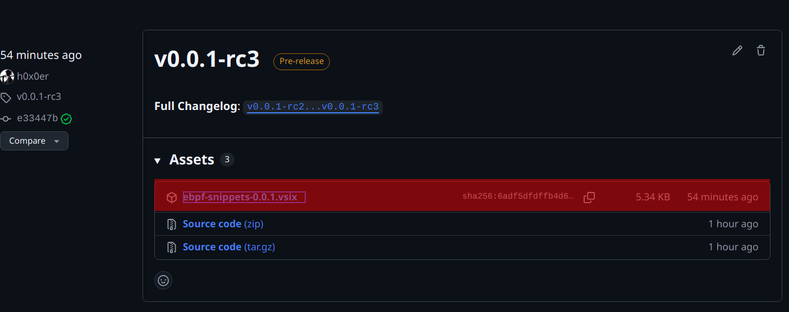
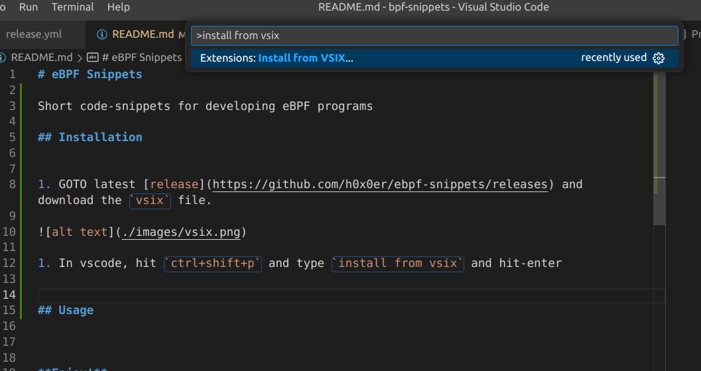

# eBPF Snippets

Code-snippets for developing eBPF programs

# Install

1. GOTO latest [release](https://github.com/h0x0er/ebpf-snippets/releases) and download the `vsix` file.

2. In vscode, hit `ctrl+shift+p`,
   1. type `install from vsixt-enter, then
   2. choose the downloaded `vsix file`

**Enjoy :)**

### References

- https://docs.ebpf.io/
- https://docs.kernel.org/bpf/libbpf/program_types.html
