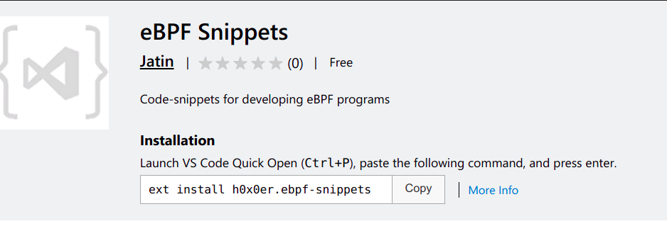

# eBPF Snippets

Code-snippets for developing eBPF programs

# Install

## Within vscode

- Search for `@category:"snippets" ebpf-snippets` in extensions and click `install`

OR

- Install using `ext install`

## From github-release

1. GOTO latest [release](https://github.com/h0x0er/ebpf-snippets/releases) and download the `vsix` file.

2. In vscode, hit `ctrl+shift+p`,
   1. type `install from vsixt-enter, then
   2. choose the downloaded `vsix file`

**Enjoy :)**

## References

- https://docs.ebpf.io/
- https://docs.kernel.org/bpf/libbpf/program_types.html

## Contribution

Improvements to **eBPF-snippets** are always welcome !  
If you’d like to contribute, feel free to open an issue or submit a pull request.  
